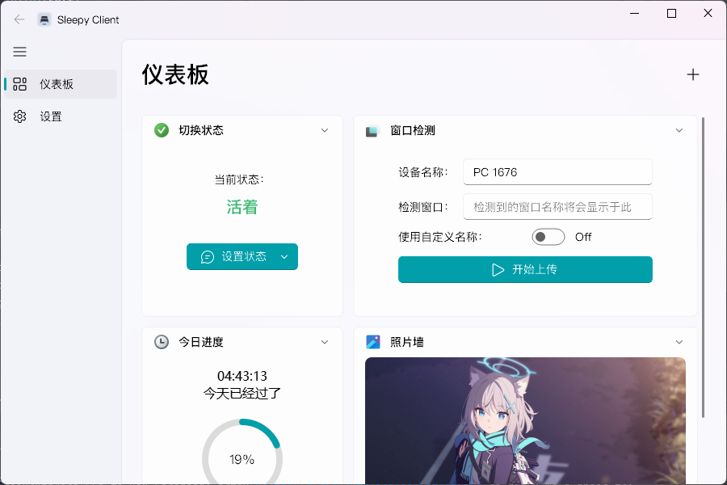

<h1>Sleepy Client</h1>

<h3 style="font-weight: normal;">采用 Fluent Design 风格的 Sleepy Client 客户端</h3>

> [!NOTE]
> 什么是 Sleepy？详见：[wyf9/sleepy](https://github.com/wyf9/sleepy)

## 介绍

### 概括
本项目是为了改善 [sleepy](https://github.com/wyf9/sleepy) 中客户端糟糕的体验诞生的。提供了更加美观的界面，更加友好的操作体验。特性请详见[此处](#特性)。

### 特性

- 精美的 Fluent Design 风格界面
- 简介明了的设置
- 更友好且方便的操作体验
- 错误处理
- 可自定义扩展（）

### 截图

浅色模式
 

深色模式

## 许可证
本插件采用了 GNU-GPLv3 许可证，详情请查看 [LICENSE](LICENSE) 文件。
Copyright © 2025 RinLit.

## 鸣谢

### 贡献者
Thanks goes to these wonderful people:

### 特别使用的资源

- [PyQt5](https://www.riverbankcomputing.com/static/Docs/PyQt5/)
- [QFluentWidgets](https://github.com/zhiyiYo/PyQt-Fluent-Widgets)